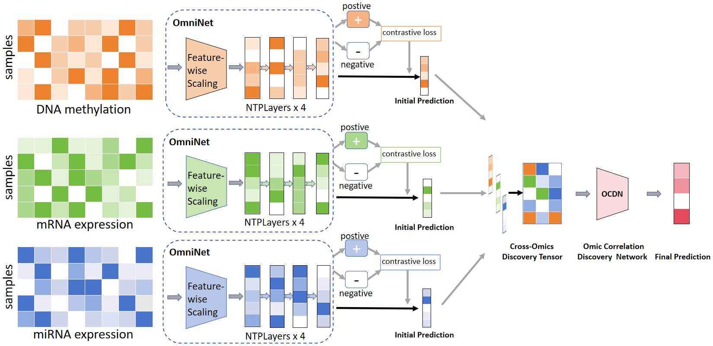

# OmniCLIC
This repository contains the code of our OmniCLIC:a unified Omics Contrastive Learning framework for effective integration and classification of multi-omics data. The data used in the paper can be obtained through the following links https://github.com/txWang/MOGONET. The code is implemented on the code provided by MOGONET. If you have any questions, please feel free to contact me via email at zhangmingzhou102@gmail.com.
## Introduction

## Requirment  
Software environment:
- Python 3  
- Pytorch 1.7.0  
- sklearn  
- numpy
Hardware environment:
- GPU: RTX 3080 Ti (12 GB) × 1
- CPU: 12 vCPU Intel(R) Xeon(R) Silver 4214R @ 2.40 GHz
- RAM: 90 GB
  
## Datasets
Due to the dataset size exceeding GitHub's maximum limit, please download the dataset from this link:https://pan.baidu.com/s/1GHHs1GrGIRDYpyZXIhcWFw?pwd=1234
## Usage
You can run the sample by running OmniCLIC_main.py
